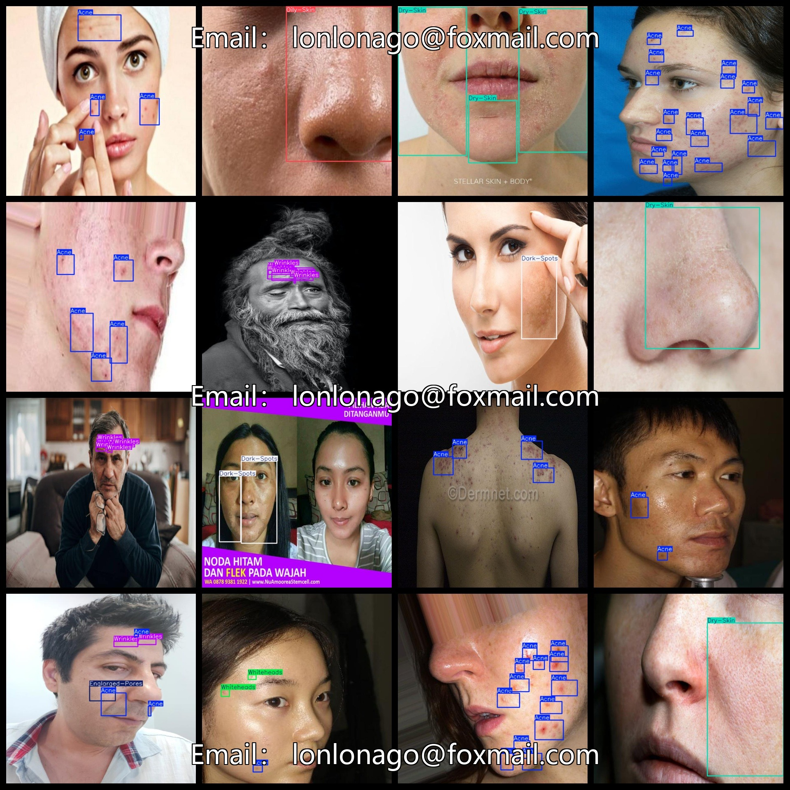
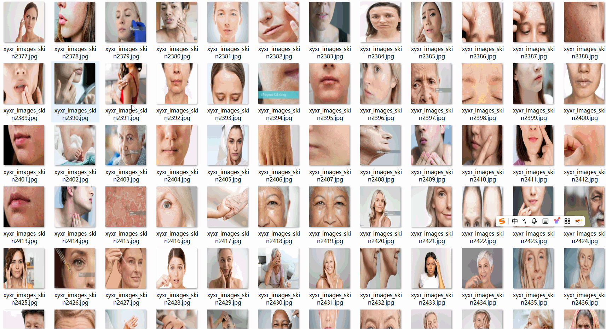

# [Object Detection] Face Parts Skin Disease Dataset - 10-class, 3213 images in YOLO+VOC format

[Object Detection] Facial dermatology dataset, 10 categories, 3213 images in YOLO and VOC format.

Dataset Format: Pascal VOC + YOLO (excluding the split-path txt file; only jpg images with corresponding VOC-format xml files and YOLO-format txt files)

The compressed file contains: three folders, each storing images, xml files, and text files.

The total number of jpg images in the JPEGImages folder is 3213.

The total number of XML files in the Annotations folder is 3213.

The total number of txt files in the labels folder is 3213.

Number of tag types: 10

Tags: ["Acne", "Blackheads", "Dark-Spots", "Dry-Skin", "Englarged-Pores", "Eyebags", "Oily-Skin", "Skin-Redness", "Whiteheads", "Wrinkles"]

Label Chinese Translation: [“acne”、“blackheads”、“black spots”、“dry skin”、“large pores”、“dark circles”、“oily skin”、“redness of the skin”、“whiteheads”、“wrinkles”]

The number of boxes for each label (Note that the order of labels in the Yolo format does not correspond to this, but is based on the classes.txt file in the labels folder):

Acne frame count = 14372

Blackheads frame count = 648

Dark-Spots frame count = 107

Dry-Skin frame count = 2123

Englarged-Pores frame count = 693

Eyebags frame count = 513

Oily-Skin frame count = 899

Skin-Redness frame count = 123

Whiteheads frame count = 636

Wrinkles frame count = 2136

Total frames: 22250

Picture clarity (Resolution: Pixels): Clear

Is the image enhanced: No

Shape of the label: Rectangular box, used for object detection and recognition.

Important Note: None

Special Notice: This dataset does not guarantee the accuracy or precision of the trained models or weight files. The dataset only provides accurate and reasonable annotations.
## Images

---

Here is a pay link on Stripe (https://buy.stripe.com/3cs8yP7sY87d0vu9AB). Please contact me lonlonago@foxmail.com after funding $89, and I will send you a complete data files, thank you!

